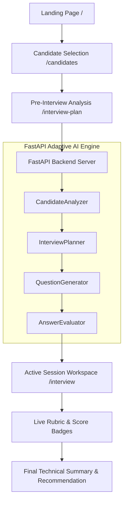

# ⚡ InterviewOS

> **The AI Technical Interviewer that adapts like a real Senior Staff Engineer.**
> *Built for the ABTalks Vibe Coding Hackathon.*


---

## 🎯 Overview

**InterviewOS** is an adaptive, real-time AI Technical Interviewer designed to conduct end-to-end technical assessments for software engineering candidates.

Unlike static quiz tools or generic chat prompts, InterviewOS dynamically analyzes a candidate's background, identifies knowledge gap areas, constructs a personalized interview plan, generates targeted architecture questions, evaluates responses against expected rubric points, and computes a comprehensive final hiring recommendation.

---

## 🏗️ Architecture & Pipeline Flow



### End-to-End Pipeline Breakdown:

1. **Candidate Analysis Engine (`CandidateAnalyzer`)**: Deterministically parses cohort signals (`missionsCompleted`, `missionsFirstTry`, `commitDays`, `skippedTopics`) to compute difficulty tier (*Beginner*, *Intermediate*, *Advanced*, *Expert*) and confidence score (`0.0 - 1.0`).
2. **Curriculum & Assessment Planner (`InterviewPlanner`)**: Selects target focus topics and determines duration rules, question counts (`4`, `5`, `6`, or `8`), opening prompt, and follow-up probing strategy.
3. **Dynamic Question Generator (`QuestionGenerator`)**: Generates structured technical questions covering Embeddings, Vector DBs, RAG, Multi-Agent Systems, MCP, Docker, and Observability, complete with expected evaluation points.
4. **Real-time Rubric Evaluator (`AnswerEvaluator`)**: Normalizes candidate text answers, matches expected rubric concepts, calculates a `0 - 10` numerical score, and tracks covered vs missing points.
5. **Final Assessment Synthesis**: Summarizes candidate performance into an overall average score, strongest competencies, identified gap areas, and a hiring recommendation (*Strong Candidate* vs *Needs Improvement*).

---

## ✨ Features

- 🏎️ **100% Zero Latency & Deterministic Execution**: Pure Python AI service pipeline with zero API rate limits, network timeouts, or token costs.
- 🎨 **Linear & Vercel Inspired UI**: High-polish dark-mode interface built with Next.js, Vanilla CSS, Tailwind, and Framer Motion micro-animations.
- 📊 **Real-Time Evaluation Badges**: Instant feedback showing covered vs missing points and score breakdowns after every answer submission.
- 🎯 **Adaptive Difficulty Scaling**: Difficulty tiers adjust duration (15m to 30m) and question counts (4 to 8 Qs) automatically based on candidate experience signals.
- 📝 **Comprehensive Hiring Summary**: Final evaluation report highlighting average score, domain strengths, gaps, and next step recommendations.

---

## 🛠️ Tech Stack

| Domain | Technology |
| :--- | :--- |
| **Frontend Framework** | Next.js 16 (App Router, Turbopack) |
| **Styling & Motion** | TailwindCSS, Vanilla CSS, Framer Motion, Lucide Icons |
| **UI Components** | Radix UI / Shadcn UI Primitives |
| **Backend API** | FastAPI, Uvicorn, Pydantic v2 |
| **Language** | TypeScript (Frontend), Python 3.12 (Backend) |

---

## 🚀 Quick Setup & Local Execution

### Prerequisites
- Node.js `v18+` & `npm`
- Python `3.10+`

### 1. Clone & Setup Backend

```bash
cd backend
python -m pip install -r requirements.txt
python -m uvicorn app.main:app --reload
```
The FastAPI backend server will start at `http://localhost:8000`. API documentation is available at `http://localhost:8000/docs`.

### 2. Setup & Run Frontend

```bash
cd frontend
npm install
npm run dev
```
Open `http://localhost:3000` in your browser to launch **InterviewOS**.

---

## 📡 API Specification

### `POST /api/interview`

#### 1. Start Interview Request
```json
{
  "sessionId": "sess-CAND-001",
  "candidate": {
    "member": {
      "id": "CAND-001",
      "name": "Sarah Johnson",
      "jobRole": "Senior Data Engineer",
      "yearsExperience": 9
    },
    "missions": [...],
    "signals": { "commitDays": 28, "missionsCompleted": 30 }
  }
}
```

#### 2. Continue Interview Request
```json
{
  "sessionId": "sess-CAND-001",
  "message": "We use vector embeddings with cosine similarity and RAG pipelines for query routing."
}
```

---

## 📜 License

Distributed under the MIT License. Built for the ABTalks Vibe Coding Hackathon.